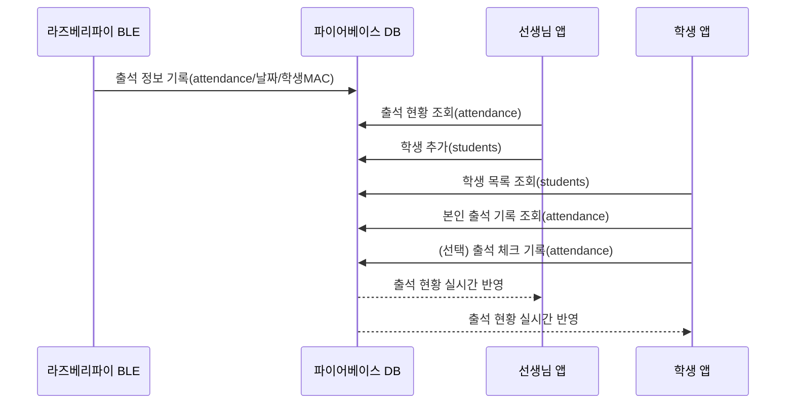

# STUDY_CHECKING 출석 자동화 시스템

## 프로젝트 소개

이 프로젝트는 고등학교 자율학습 출석을 자동화하기 위한 시스템입니다. 선생님 앱, 학생 앱, 라즈베리파이 BLE 출석 체크 3가지로 구성되어 있으며, 파이어베이스 실시간 데이터베이스를 통해 모든 데이터가 실시간으로 연동됩니다.

---

## 전체 구조 및 상호작용

- **라즈베리파이 BLE 출석 체크**: 학생 스마트폰의 BLE 신호를 감지하여 출석을 자동으로 기록
- **선생님 앱**: 학생 관리, 출석 현황 실시간 확인
- **학생 앱**: 본인 출석 확인, 직접 출석 체크 가능
- **파이어베이스**: 모든 데이터의 중심 허브 역할

### 상호작용 다이어그램



---

## 주요 기술 및 원리 설명

### 1. 파이어베이스 실시간 데이터베이스
- 클라우드 기반 NoSQL DB로, 여러 기기에서 데이터를 실시간으로 읽고 쓸 수 있습니다.
- 출석 정보(attendance), 학생 정보(students) 등 모든 데이터가 저장됩니다.
- 각 앱은 파이어베이스와 연동하여 데이터를 실시간으로 주고받습니다.

### 2. 네트워크 기반 출석 (Wi-Fi)
- 라즈베리파이가 같은 네트워크에 접속한 기기들의 MAC 주소를 스캔하여 출석 체크가 가능합니다.
- 단, MAC 주소 랜덤화 등으로 인해 100% 신뢰할 수는 없으나, 별도의 앱 설치 없이 자동화가 가능합니다.

### 3. 블루투스(BLE) 기반 출석
- BLE(Bluetooth Low Energy)는 저전력 블루투스 통신 방식입니다.
- 학생 스마트폰에서 BLE 신호(Beacon)를 송출하면, 라즈베리파이가 이를 감지하여 출석을 자동 기록합니다.
- BLE 신호는 근거리(수 미터 이내)에서만 감지되므로, 실제로 학생이 교실에 있어야만 출석이 인정됩니다.
- 대리 출석 방지에 효과적입니다.

#### BLE 출석 작동 원리
1. 학생 스마트폰에서 BLE Beacon 앱 실행(고유 MAC 주소 송출)
2. 라즈베리파이에서 BLE 스캐너(bleak 등)로 신호를 10초간 스캔
3. 등록된 MAC 주소가 감지되면 파이어베이스에 출석 정보 기록
4. 선생님/학생 앱에서 실시간으로 출석 현황 확인

---

## 실행 방법

### 1. 패키지 설치
```bash
pip3 install -r requirements.txt
```

### 2. 선생님 앱 실행
```bash
python3 teacher_app_firebase.py
```

### 3. 학생 앱 실행
```bash
python3 student_app_firebase.py --port 8551
```

### 4. 라즈베리파이 BLE 출석 체크 실행
```bash
python3 ble_attendance_rpi.py
```

### 5. 파이어베이스 실시간 데이터베이스 규칙(테스트용)
```json
{
  "rules": {
    ".read": true,
    ".write": true
  }
}
```

---

## 주요 파일 설명
- `teacher_app_firebase.py` : 선생님용 출석 관리 앱
- `student_app_firebase.py` : 학생용 출석 체크 앱
- `ble_attendance_rpi.py` : 라즈베리파이 BLE 출석 체크 스크립트
- `firebase_config.py` : 파이어베이스 설정 정보
- `requirements.txt` : 필요 패키지 목록

---

## 참고 및 확장 아이디어
- BLE 외에도 NFC, QR코드, Wi-Fi 등 다양한 자동 출석 방식으로 확장 가능
- 파이어베이스 인증, 관리자 기능, 출석 통계 등 추가 기능 구현 가능
- 향후에는 파이어베이스 보안 규칙 강화
